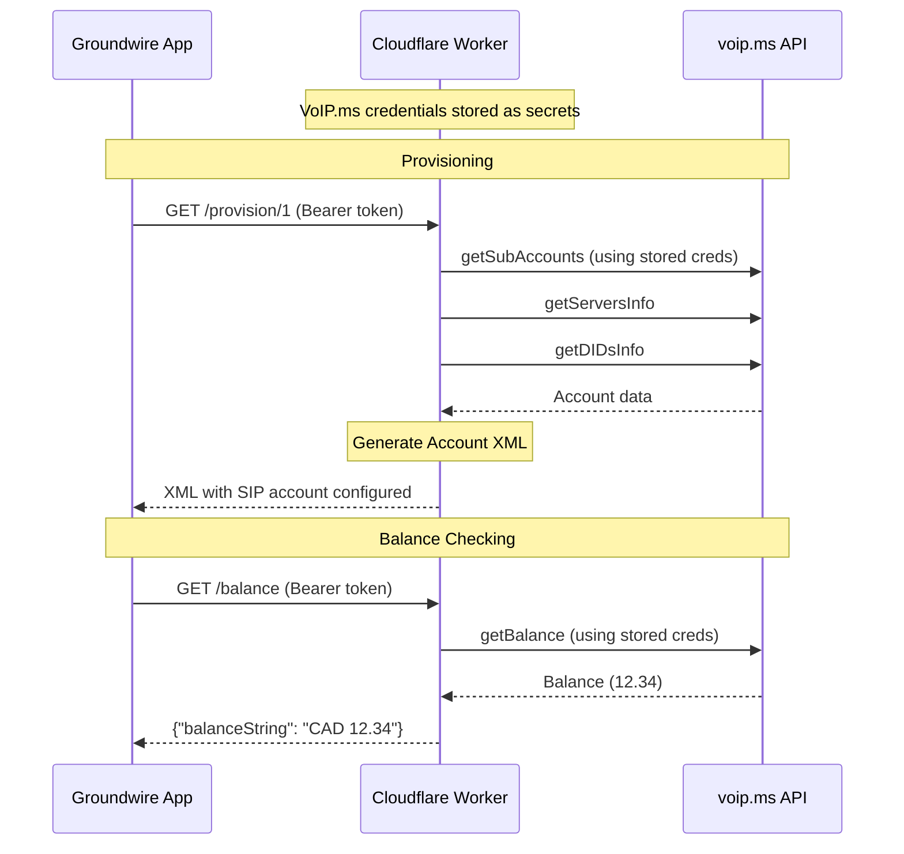

# Groundwire Auto-Provisioning for VoIP.ms

A Cloudflare Worker that enables **automatic provisioning** of [Groundwire](https://www.acrobits.net/groundwire/) (iOS/Android VoIP app) with your [VoIP.ms](https://voip.ms) account. Deploy once, configure Groundwire with a simple Bearer token, and all your SIP accounts are automatically set up.

## Features

- **Secure by design**: VoIP.ms credentials stored in Cloudflare secrets, never transmitted
- **Simple auth**: Single Bearer token for Groundwire authentication
- **Multi-account support**: Separate endpoints for each VoIP.ms sub-account (`/provision/1`, `/provision/2`)
- **Balance checker**: See your VoIP.ms balance directly in Groundwire
- **Auto-sync**: Configuration refreshes every 24 hours

## Architecture



## Quick Start

### 1. Configure VoIP.ms API

1. Go to [VoIP.ms API page](https://voip.ms/m/api.php)
2. Click `Enable/Disable API` → Ensure it shows **Enabled**
3. Set an **API Password** (different from your login password)
4. Set `Enable IP Addresses` to `0.0.0.0` (required for Cloudflare Workers)

> **Security Note**: The API password only grants read access to account info and cannot make calls or spend money.

### 2. Deploy Cloudflare Worker

```bash
# Clone the repository
git clone https://github.com/andrew-hesse/voipms-groudwire-cloudflare-worker.git
cd voipms-groudwire-cloudflare-worker

# Install dependencies
pnpm install

# Generate a random auth token
openssl rand -base64 32
# Save this token - you'll need it for Groundwire!

# Set required secrets
wrangler secret put VOIP_MS_USERNAME   # Your VoIP.ms API email
wrangler secret put VOIP_MS_PASSWORD   # Your VoIP.ms API password
wrangler secret put AUTH_TOKEN         # The random token you generated

# Deploy
pnpm run deploy
```

After deployment, note your worker URL (e.g., `https://voipms-groundwire.your-subdomain.workers.dev`)

### 3. Configure Groundwire

You need to configure **two things** in Groundwire: External Provisioning and Balance Checker. Both require the Bearer token.

#### External Provisioning

1. Open Groundwire → **Settings** → **Accounts** → **New Account** → **Generic SIP**
2. Tap **Advanced Settings** → **Web Services** → **External Provisioning**
3. Fill in:

   | Field | Value |
   |-------|-------|
   | **URL** | `https://your-worker.workers.dev/provision/1` |
   | **Custom Headers** | `Authorization: Bearer YOUR_AUTH_TOKEN` |
   | **Method** | GET |

   > For your second VoIP.ms sub-account, use `/provision/2`, etc.

4. Tap **Done** - Groundwire will provision the SIP account

#### Balance Checker

The balance checker URL is set automatically during provisioning, but **you must manually add the Authorization header**:

1. After provisioning, go to the account settings
2. Navigate to **Advanced Settings** → **Web Services** → **Balance Checker**
3. Add **Custom Headers**: `Authorization: Bearer YOUR_AUTH_TOKEN`


## How It Works

### Simplified Security Model

Unlike traditional provisioning where credentials are passed with each request, this worker:

1. **Stores VoIP.ms credentials** securely in Cloudflare secrets
2. **Uses a simple Bearer token** for Groundwire authentication
3. **Never exposes VoIP.ms credentials** in URLs or responses

This is more secure because:
- Credentials never leave Cloudflare's infrastructure
- Bearer token can be rotated without changing VoIP.ms credentials
- No credential substitution issues with Groundwire placeholders

### Account Selection

Since Groundwire only supports provisioning one account per XML response (Acrobits limitation), each sub-account has its own endpoint:

- `/provision/1` - First sub-account
- `/provision/2` - Second sub-account
- etc.

### Auto-Sync

The generated XML includes re-provisioning settings that tell Groundwire to check for updates every 24 hours, automatically picking up server changes or new phone numbers.

## API Endpoints

| Endpoint | Method | Auth | Description |
|----------|--------|------|-------------|
| `/provision/1` | GET/POST | Bearer token | Provision first sub-account |
| `/provision/2` | GET/POST | Bearer token | Provision second sub-account |
| `/balance` | GET | Bearer token | Check account balance |
| `/health` | GET | None | Health check |

## Configuration

### Required Secrets

Set these using `wrangler secret put`:

| Secret | Description |
|--------|-------------|
| `VOIP_MS_USERNAME` | Your VoIP.ms API email address |
| `VOIP_MS_PASSWORD` | Your VoIP.ms API password |
| `AUTH_TOKEN` | Random token for Groundwire auth |

### Optional Settings

Edit `wrangler.toml`:

```toml
[vars]
# Currency shown in balance display
CURRENCY = 'CAD'

# Rate limiting (per IP)
RATE_LIMIT_REQUESTS = '10'
RATE_LIMIT_WINDOW_SECONDS = '60'

# Debug logging
DEBUG = 'false'
```

### Optional: Enable KV for Rate Limiting

```bash
wrangler kv namespace create SECURITY_KV
wrangler kv namespace create BALANCE_CACHE
```

Add the IDs to `wrangler.toml`:

```toml
[[kv_namespaces]]
binding = "SECURITY_KV"
id = "your-security-kv-id"

[[kv_namespaces]]
binding = "BALANCE_CACHE"
id = "your-balance-cache-id"
```

## Project Structure

```
src/
├── index.ts                 # Router & main entry
├── types.ts                 # Environment schema & types
├── api/
│   ├── schemas.ts          # Zod schemas for VoIP.ms API
│   └── voipms.ts           # VoIP.ms API client
├── provisioning/
│   ├── handler.ts          # Provisioning endpoint
│   └── xml-generator.ts    # Account XML generation
├── balance/
│   └── handler.ts          # Balance endpoint
├── security/
│   ├── rate-limiter.ts     # IP-based rate limiting
│   ├── auth.ts             # Bearer token validation
│   └── audit-log.ts        # Security logging
└── utils/
    ├── constants.ts        # Shared constants
    ├── errors.ts           # Custom error classes
    └── helpers.ts          # Utility functions
```

## Development

```bash
pnpm install      # Install dependencies
pnpm dev          # Run locally
pnpm test         # Run tests
pnpm typecheck    # Type check
pnpm run deploy   # Deploy to Cloudflare
```

## Security

- **Credentials in Cloudflare**: VoIP.ms credentials stored as secrets, never transmitted
- **Bearer Token Auth**: Simple, rotatable authentication for Groundwire
- **User-Agent Validation**: Only accepts requests from Groundwire/Acrobits clients
- **Rate Limiting**: Configurable per-IP rate limiting
- **HTTPS Only**: Cloudflare enforces TLS
- **Audit Logging**: All requests logged (credentials never logged)

## Troubleshooting

### "IP not enabled" error

Your Cloudflare Worker's IP isn't allowed in VoIP.ms. Set `Enable IP Addresses` to `0.0.0.0` in your [VoIP.ms API settings](https://voip.ms/m/api.php).

### "Unauthorized" error

- Verify the Bearer token in Groundwire matches your `AUTH_TOKEN` secret
- Check the Authorization header format: `Authorization: Bearer YOUR_TOKEN`

### Balance not showing

- Ensure you added the `Authorization: Bearer` header to the Balance Checker settings
- The URL is set automatically, but the auth header must be added manually

### Invalid account index

- Check how many sub-accounts you have in VoIP.ms
- Use `/provision/1` for the first, `/provision/2` for the second, etc.

### Debug mode

Set `DEBUG = 'true'` in `wrangler.toml` and check Cloudflare Worker logs.

## License

MIT

## Contributing

Pull requests welcome! Please run `pnpm test` and `pnpm typecheck` before submitting.
