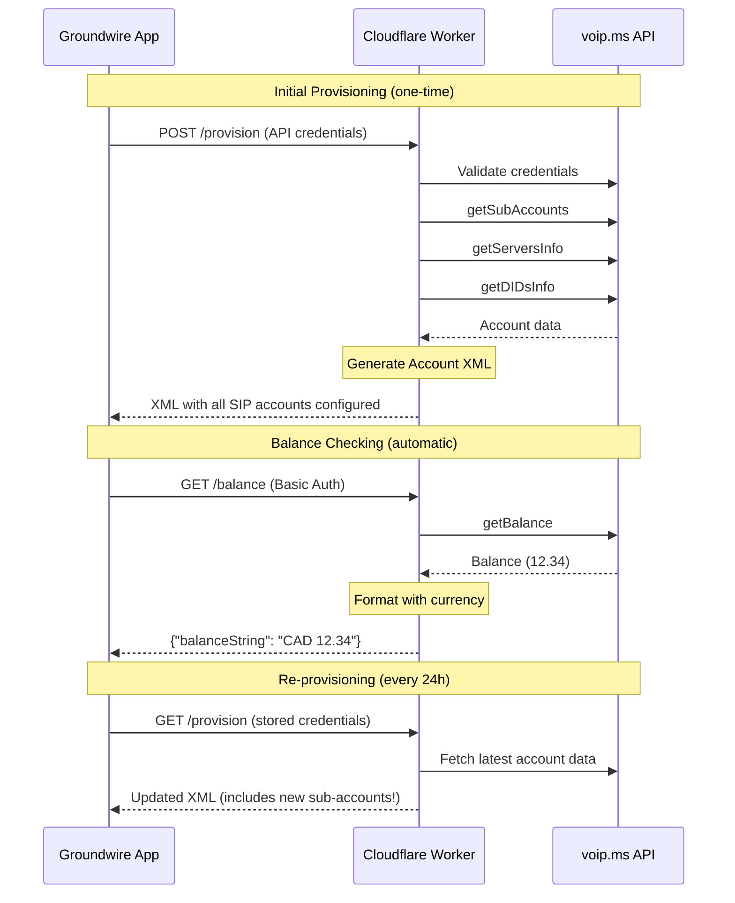

# Groundwire Auto-Provisioning for VoIP.ms

[](https://deploy.workers.cloudflare.com/?url=https://github.com/andrew-hesse/voipms-groudwire-cloudflare-worker)

A Cloudflare Worker that enables **automatic provisioning** of [Groundwire](https://www.acrobits.net/groundwire/) (iOS/Android VoIP app) with your [VoIP.ms](https://voip.ms) account. Enter your VoIP.ms API credentials once, and Groundwire automatically configures all your SIP accounts, servers, and balance checking.

## Features

- **One-time setup**: Enter VoIP.ms API credentials in Groundwire, everything else is automatic
- **Auto-sync**: New VoIP.ms sub-accounts appear in Groundwire within 24 hours
- **Balance checker**: See your VoIP.ms balance directly in Groundwire
- **Multi-account support**: Configures all your VoIP.ms sub-accounts at once
- **Secure**: Rate limiting, brute force protection, and audit logging

## Architecture



## Quick Start

### 1. Configure VoIP.ms API

1. Go to [VoIP.ms API page](https://voip.ms/m/api.php)
2. Click `Enable/Disable API` → Ensure it shows **Enabled**
3. Set an **API Password** (different from your login password)
4. Set `Enable IP Addresses` to `0.0.0.0` (required for Cloudflare Workers)

> ⚠️ **Security Note**: The API password only grants read access to account info and cannot make calls or spend money.

### 2. Deploy Cloudflare Worker

**Option A: One-Click Deploy**

[](https://deploy.workers.cloudflare.com/?url=https://github.com/andrew-hesse/voipms-groudwire-cloudflare-worker)

**Option B: Manual Deploy**

```bash
# Clone the repository
git clone https://github.com/andrew-hesse/voipms-groudwire-cloudflare-worker.git
cd voipms-groudwire-cloudflare-worker

# Install dependencies
pnpm install

# Configure (edit wrangler.toml)
# Set CURRENCY to your preferred currency (CAD, USD, etc.)

# Deploy
pnpm wrangler deploy
```

After deployment, note your worker URL (e.g., `https://groundwire.your-subdomain.workers.dev`)

### 3. Configure Groundwire

1. Open Groundwire → **Settings** → **Accounts** → **New Account** → **Generic SIP**
2. Tap **Advanced Settings** → **Web Services** → **External Provisioning**
3. Fill in the following fields:

   | Field | Value |
   |-------|-------|
   | **URL** | `https://groundwire.your-subdomain.workers.dev/provision` |
   | **Username** | Your VoIP.ms email |
   | **Password** | Your VoIP.ms **API password** (from step 1) |

   Leave other fields (POST data, Content Type, etc.) at their defaults.

4. Tap **Done**

Groundwire will automatically configure all your VoIP.ms sub-accounts!

## How It Works

### Provisioning Flow

When you provision Groundwire, the worker:

1. Validates your VoIP.ms API credentials
2. Fetches all your sub-accounts via `getSubAccounts`
3. Fetches server information via `getServersInfo`
4. Fetches your phone numbers via `getDIDsInfo`
5. Generates [Acrobits Account XML](https://doc.acrobits.net/api/client/account_xml.html) with:
   - SIP username/password for each sub-account
   - Correct SIP server based on your configured POP
   - NAT traversal (ICE/STUN) settings for VoIP.ms
   - SRTP security enabled
   - Optimal codec configuration
   - Balance checker URL with your credentials
   - Re-provisioning URL (checks every 24 hours)

### Auto-Sync

The generated XML includes `<extProvUrl>` and `<extProvInterval>`, which tells Groundwire to:

- Check for configuration updates every 24 hours
- Automatically add new sub-accounts you create in VoIP.ms
- Update server/settings changes

### Balance Checking

The XML configures Groundwire's balance checker to call `/balance` with your stored credentials. Your balance appears in the Groundwire interface:


## API Endpoints

| Endpoint     | Method | Auth         | Description            |
| ------------ | ------ | ------------ | ---------------------- |
| `/provision` | POST   | Form/Basic   | Initial provisioning   |
| `/provision` | GET    | Query params | Re-provisioning (auto) |
| `/balance`   | GET    | Basic Auth   | Balance check          |
| `/health`    | GET    | None         | Health check           |

## Configuration

Edit `wrangler.toml` to customize:

```toml
[vars]
# Currency shown in balance display
CURRENCY = 'CAD'

# Rate limiting
RATE_LIMIT_REQUESTS = '10'        # Max requests per minute
RATE_LIMIT_WINDOW_SECONDS = '60'

# Brute force protection
BRUTE_FORCE_MAX_ATTEMPTS = '5'    # Failed logins before lockout
BRUTE_FORCE_LOCKOUT_SECONDS = '900'  # 15 minute lockout
```

### Optional: Enable KV for Security Features

For rate limiting and brute force protection to persist across requests:

```bash
# Create KV namespaces
wrangler kv namespace create SECURITY_KV
wrangler kv namespace create BALANCE_CACHE
```

Then add the IDs to `wrangler.toml`:

```toml
[[kv_namespaces]]
binding = "SECURITY_KV"
id = "your-security-kv-id"

[[kv_namespaces]]
binding = "BALANCE_CACHE"
id = "your-balance-cache-id"
```

## Project Structure

```
src/
├── index.ts                 # Router & main entry
├── types.ts                 # Environment schema & types
├── api/
│   ├── schemas.ts          # Zod schemas for VoIP.ms API
│   └── voipms.ts           # VoIP.ms API client
├── provisioning/
│   ├── handler.ts          # Provisioning endpoint
│   └── xml-generator.ts    # Account XML generation
├── balance/
│   └── handler.ts          # Balance endpoint
├── security/
│   ├── rate-limiter.ts     # IP-based rate limiting
│   ├── brute-force.ts      # Credential lockout
│   ├── auth.ts             # Authentication parsing
│   └── audit-log.ts        # Security logging
└── utils/
    ├── constants.ts        # Shared constants
    ├── errors.ts           # Custom error classes
    └── helpers.ts          # Utility functions
```

## Development

```bash
# Install dependencies
pnpm install

# Run locally
pnpm dev

# Run tests
pnpm test

# Type check
pnpm typecheck

# Deploy
pnpm wrangler deploy
```

## Security

- **User-Agent Validation**: Only accepts requests from Groundwire/Acrobits clients
- **Rate Limiting**: 10 requests/minute per IP (configurable)
- **Brute Force Protection**: 5 failed attempts = 15 minute lockout (configurable)
- **Audit Logging**: All auth attempts logged (passwords never logged)
- **HTTPS Only**: Cloudflare enforces TLS
- **Credential Validation**: Every request validates against VoIP.ms API

## Troubleshooting

### "IP not enabled" error

Your Cloudflare Worker's IP isn't allowed in VoIP.ms. Set `Enable IP Addresses` to `0.0.0.0` in your [VoIP.ms API settings](https://voip.ms/m/api.php).

### "Authentication failed" in Groundwire

- Verify you're using your **API password**, not your VoIP.ms login password
- Check that API is **Enabled** in VoIP.ms settings

### Balance not showing

- Ensure provisioning completed successfully
- Check Groundwire's balance checker settings (should be auto-configured)

### Debug mode

Set `DEBUG = 'true'` in `wrangler.toml` and check Cloudflare Worker logs for detailed request info.

## License

MIT

## Contributing

Pull requests welcome! Please run `pnpm test` and `pnpm typecheck` before submitting.
